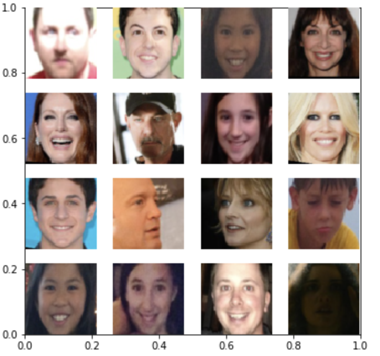
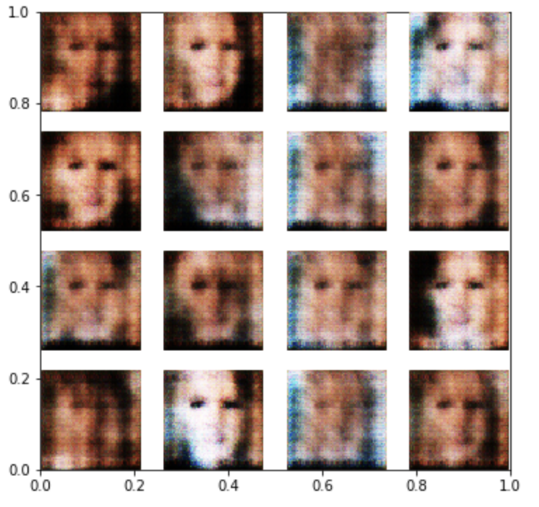
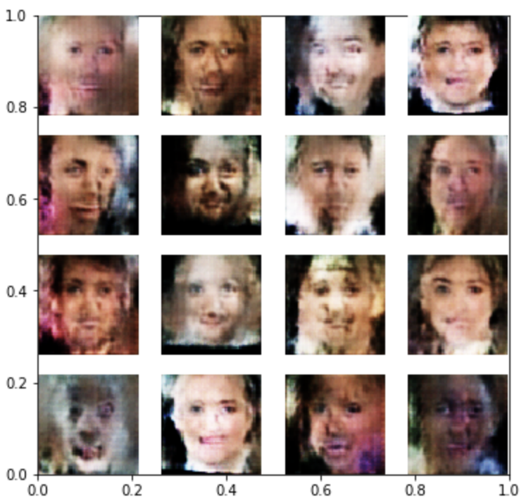
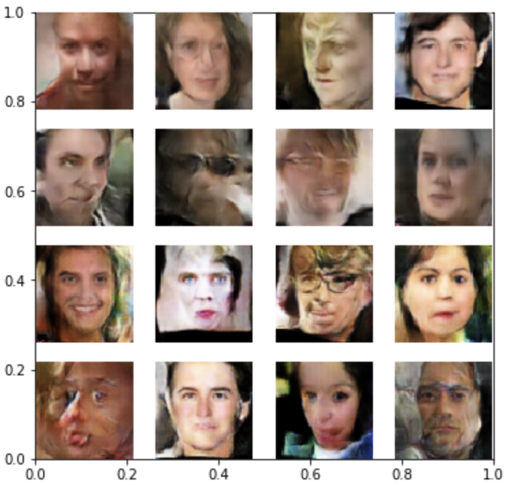

## DCGAN on Face Image Dataset
---
This project implements the [DCGAN(Deep Convolutional Generative Adversarial Network)](https://arxiv.org/pdf/1511.06434.pdf) on the Face Image Dataset. The goal of this project is to generate fake face images which can be used for data augmentation.

### Dataset

The dataset can be downloaded from [Face Image Project](https://talhassner.github.io/home/projects/Adience/Adience-data.html#agegender). The basic structure of the face dataset folder (default name: combined):

       ├── aligned  <-- 29,437 train data
       |   ├── 01_F <-- This subfolder contains the images with gender 'F' and age `01`.
       |   ├── 01_M
       |   ├── 02_F
       |   ├── 02_M
       |   └── ...
       └── valid    <-- 3,681 test data
           ├── 01_F 
           ├── 01_M
           ├── 02_F
           └── ...
          

The size of each image is `128*128*3` with color channels `RGB`. In the project, each image was downsampled to `64*63*3`. 

### Content

- [The step-by-step notebook: dcgan_face.ipybn](dcgan_face.ipynb)

- [Python script: dcgan_face.py](dcgan_face.py)

  Usage: `python dcgan_face.py`

### Dependeicies 
- numpy
- pytorch
- torchvision
- tqdm

### Results
**Original Images**

Original sample images:
  

**Generated Images**

After 1 epoch:
  

After 5 epochs:
  

After 30 epochs:
  

