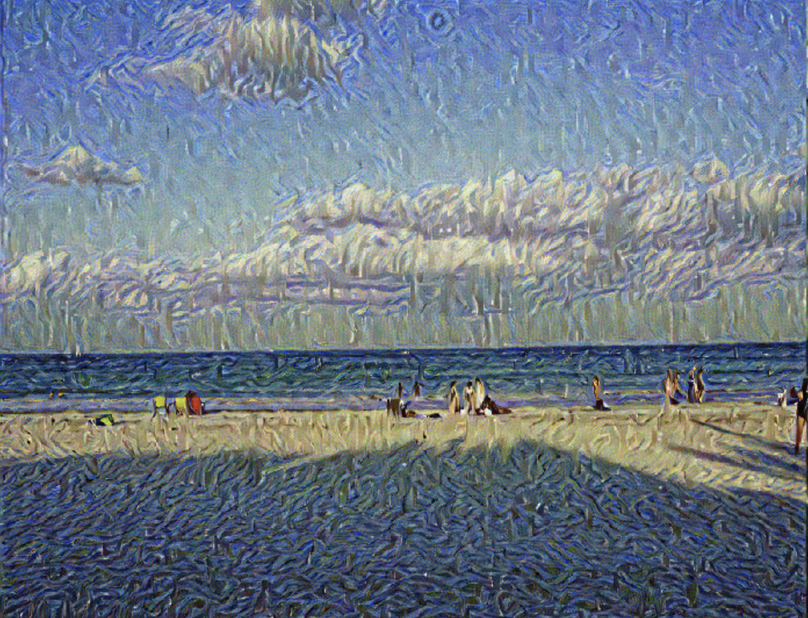

# Neural Style Transfer
---

This notebook contains a typical machine learning/computer vision problem: **Neural Style Transfer**. With a content image (C) and a style image (S), we are able to generate a image (G) with C's content and S's style. The following images show how a photo can be combined with Van Gogh's painting and generate a new image.

Content Image: C
  

Style Image: S
 

Generated Image: G
  

---
### Acknowledgement:
Some ideas come from [Deep Learning Course on Coursera](https://www.deeplearning.ai/deep-learning-specialization/) (e.g., the weights of style loss and content loss) and [Pytorch tutorial](https://pytorch.org/tutorials/) (e.g. model loading).
