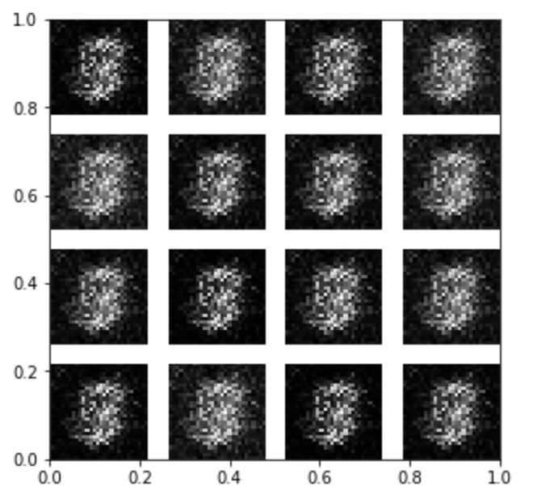
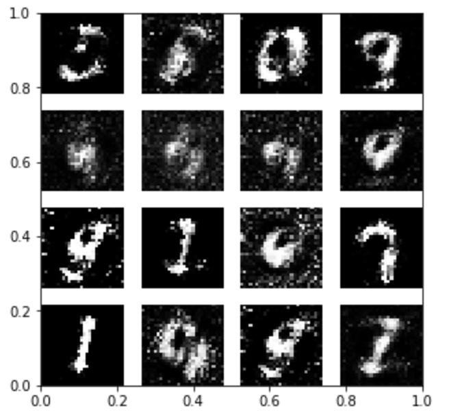
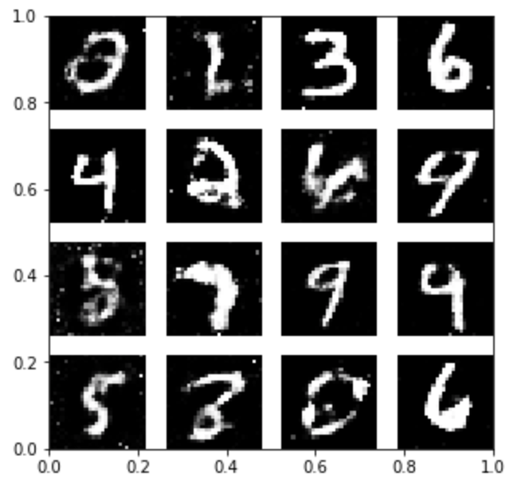

## Vanilla GAN on MNIST
---
This project implements the Vanilla [GAN(Generative Adversarial Network)](https://papers.nips.cc/paper/5423-generative-adversarial-nets.pdf) on the [MNIST dataset](http://yann.lecun.com/exdb/mnist/). The goal of this project is to generate fake digit images which can be used for data augmentation.

### Content

- [The step-by-step notebook](gan_mnist.ipynb)

- [Python script](gan_mnist.py)

  Usage: `python gan_mnist.py`

### Dependeicies 
- numpy
- pytorch
- torchvision
- tqdm

### Results

After 1 epoch:
  

After 10 epochs:
  

After 100 epochs:
  

